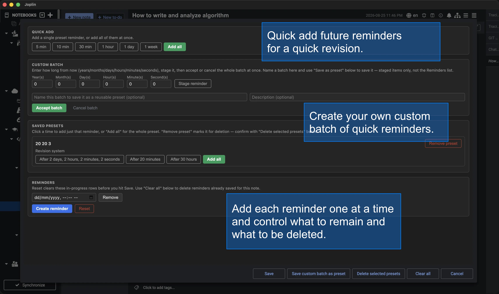

<p align="center">
  
</p>

<h1 align="center">Advanced Reminder</h1>

<p align="center">
  A Joplin plugin that adds support for multiple reminder times on a single To-Do note.
</p>

Joplin's native To-Do notes only support one reminder (`todo_due`). Advanced
Reminder keeps its own list of reminder times per note and automatically
keeps Joplin's single native alarm in sync with the earliest one still in
the future — so a note can have as many reminders as it needs, and Joplin
still fires an alarm at the right moment every time.

<p align="center">
  
</p>

## Features

**Creating reminders** — four ways to build a note's reminder list, all in
one dialog:

- **Reminders** — the note's actual list; add a blank row and pick a date/time,
  or edit/remove any row directly.
- **Quick add** — one-click preset offsets (5 min, 10 min, 30 min, 1 hour,
  1 day, 1 week), individually or all at once.
- **Custom batch** — describe a reminder in plain terms (years / months /
  days / hours / minutes / seconds from now), stage as many as you like,
  then accept or cancel the whole batch together. Name a batch (with an
  optional description) to save it as a reusable preset.
- **Saved presets** — apply a single time or an entire saved preset with
  one click; remove presets you no longer want.

**Keeping the list clean and correct:**

- **Reset** clears in-progress, unsaved rows in the open dialog; **Clear
  all** deletes every reminder already saved to the note — two distinct,
  clearly-labeled actions so neither is a surprise for the other.
- Duplicate prevention on every creation path (single entry, quick-add,
  batch, saved-preset) — checked immediately as you add something, and
  enforced again at Save so nothing can slip through.
- Rejects reminders already in the past, zero/negative/overflowing custom
  durations, and non-numeric input in the duration fields, with a clear
  in-dialog message for each.
- Preset names and descriptions are validated and HTML-escaped before
  they're ever rendered back into the dialog.

**Staying in sync with Joplin:**

- A toolbar button / command ("Manage reminders"), enabled only on To-Do
  notes.
- Automatically imports a note's existing native reminder (`todo_due`) into
  the list the first time you open the dialog on it, so nothing already set
  gets lost — and never re-imports it once the note is managed by this
  plugin, so a reminder you've cleared stays cleared.
- Keeps Joplin's native alarm (`todo_due`) in sync with the earliest
  upcoming reminder — updates it only when it actually needs to change.
- When a reminder fires, automatically promotes the next one in the list,
  including catching up on startup if Joplin was closed when the promotion
  should have happened.
- Dialog respects Joplin's light/dark theme, including its own in-dialog
  notice banner for warnings and confirmations.

## Requirements

Joplin desktop 3.6 or later.

## Installation

**From Joplin:** Configuration > Plugins, search for "Advanced Reminder",
install. Note: the version in Joplin's plugin catalog is only refreshed
when a new version is published to npm — see
[Development](#development) if you want the latest features before then.

**Manual install:** download or build `com.advancedreminder.joplin.jpl`
(see [Development](#development) below), then in Joplin go to
Configuration > Plugins > the gear/menu icon > "Install from file", and
select the `.jpl`. Restart Joplin when prompted.

## Usage

1. Open or create a To-Do note.
2. Click the "Manage reminders" toolbar button (or run the command from the
   command palette) — it's only enabled on To-Do notes.
3. Build the note's reminder list any combination of ways: add rows
   directly under **Reminders**, click a preset under **Quick add**, stage
   and accept a **Custom batch**, or apply a **Saved preset** — then click
   **Save**.
4. Use **Reset** to discard in-progress rows before saving, or **Clear
   all** to delete everything already saved to the note. Build a reusable
   preset from a Custom batch with **Save as preset**, or remove one you no
   longer want.
5. Joplin will alert you at the earliest upcoming time; when it fires, the
   next reminder in the list automatically takes over.

## Development

This project uses **pnpm** (not npm or yarn) as its package manager, and
was scaffolded with the official [Joplin plugin
generator](https://github.com/laurent22/joplin/tree/dev/packages/generator-joplin).
See [GENERATOR_DOC.md](./GENERATOR_DOC.md) for generator/build-framework
details, and [docs/](./docs) for this plugin's own architecture and
feature-by-feature implementation notes.

```bash
pnpm install
pnpm test        # run the test suite
pnpm run dist     # build dist/ and publish/*.jpl
```

To test the built plugin without publishing, install the generated
`publish/com.advancedreminder.joplin.jpl` via Joplin's "Install from file",
or point Joplin's Configuration > Plugins > Advanced Settings >
"Development plugins" field at this repository's root for live development
mode.

## Contributing

- Use `pnpm` for all dependency management — don't introduce a
  `package-lock.json` or `yarn.lock`.
- Run `pnpm test` and `pnpm run dist` before submitting a change; both must
  pass cleanly.
- Don't commit personal editor configuration. In particular, this repo
  currently has a tracked `.vscode/settings.json` containing one
  contributor's personal window-color theming (Peacock) — if you're
  working in this repo, delete or gitignore `.vscode/` rather than
  committing your own editor preferences on top of it.
- Follow the existing module-per-responsibility structure (see
  [docs/](./docs) for the architecture): pure logic stays free of any
  `joplin` import where possible, persistence/reconciliation/dialog code
  stay in their own files, and generator-managed files (`api/`,
  `webpack.config.js`) shouldn't be hand-edited.
- `src/manifest.json`'s plugin `id` (`com.advancedreminder.joplin`) is
  permanent once published — Joplin's plugin repository ties it to this
  npm package name and will reject it if it ever appears under a different
  package.

## License

[GPL-3.0](./LICENSE)

## Project Status

Actively developed past its initial scope — batching, saved presets,
duplicate prevention, and input validation have all landed since the first
release (see [docs/00-roadmap.md](./docs/00-roadmap.md) for the full
feature-by-feature history). Verified on Joplin desktop 3.6.15.

The npm package has been published once (`joplin-plugin-advanced-reminder`,
picked up by Joplin's plugin repository), but at an earlier version — the
catalog listing won't reflect the current feature set or manifest
`keywords`/`categories` until a newer version is published.
